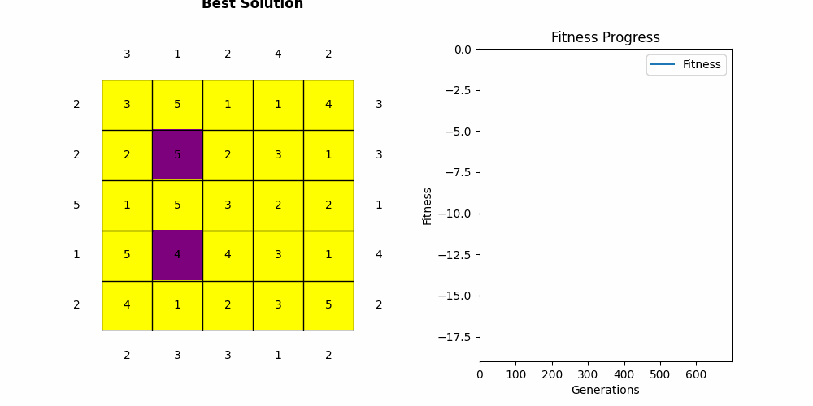

# Skyscraper Puzzle Solver with Genetic Algorithm

This project implements a Genetic Algorithm (GA) to solve the Skyscraper puzzle. It includes both a graphical user interface (GUI) and a terminal text view for solving and visualizing the puzzle.
The goal of this project is to test the performance of Genetic Algorithm using skyscraper puzzle as NP-complete problem. <br>




## Table of Contents

- [Introduction](#introduction)
- [Features](#features)
- [Running the Project](#running-the-project)
  - [Using the GUI](#using-the-gui)
  - [Using the Terminal](#using-the-terminal)
- [Adding Custom Puzzles](#adding-custom-puzzles)
- [Benefits](#benefits)
- [Use Cases](#use-cases)
- [TODO](#todo)
- [License](#license)

## Introduction

The Skyscraper puzzle is a logic game where the objective is to place skyscrapers in a grid such that the number of visible skyscrapers from each direction matches the given clues. This project uses a Genetic Algorithm to find solutions to the puzzle.

## Features

- Solve Skyscraper puzzles using a Genetic Algorithm
- Graphical User Interface (GUI) for interactive solving
- Terminal text view for command-line solving

## Running the Project
I developed this project using Vscode, in order to run the project the project using termonal text interface it just need to have Java installed on the matchine along with Java development pack extention in vscode. To run the GUI, javafx library is required to have. Here I attached the vscode settings along with the necessary libraries. to compile the java codes it required to using buil option of vscode which using command palette.

### Using GUI
In order to run project using GUI first build java codes with `command palette > Tasks: Run build task` then run gui with `command palette > Tasks: run task`.

### Usinng terminal text interface
build the java codes: `javac Main.java`
run the code: `java Main instances/4x4.txt`

## Adding Custom Puzzles
Create a new text file with the puzzle clues in the following format: <br>

```
3 1 3 2     # Top clues (from left to right)
2 1 3 2     # Right clues (from top to bottom)
2 4 1 2     # Bottom clues (from left to right)
2 3 1 2     # Left clues (from top to bottom)
```

## Use Cases
- Educational Tool: This project can be used to teach and demonstrate the principles of Genetic Algorithms and their application to solving logic puzzles.
- Puzzle Solving: Users can solve Skyscraper puzzles of varying difficulty levels, either interactively or via the command line.
- Research: Researchers can use this project to experiment with different GA parameters and strategies to optimize puzzle-solving performance.
